# CodeCreatePlay Tutorials

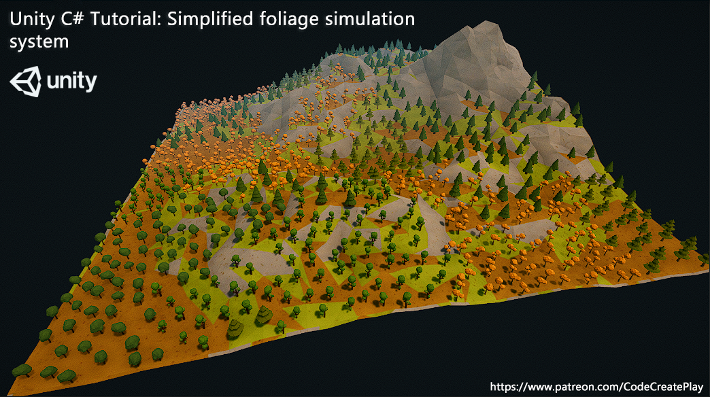

This is an overview of a simplified foliage simulation algorithm and how to scatter foliage for your terrains, this will not involve simulating any complex inter specie or intra specie rivalry for resources and sunlight, a more advanced survival algorithm is needed to model interactions, but that's a topic for another day.  

> Visit patreon.com/CodeCreatePlay to download project files for this tutorial.

This simplified foliage simulation algorithm is completed in three steps.
* **Scattering foliage seeds**: this can be done either procedurally or manually. 
* **The simulation step**: at each simulation step a seed is considered to be grown into a fully matured foliage object (tree, grass etc.) which in turn scatters more seeds in surrounding areas, these new seeds are marked as "open" while existing parent seeds are marked as "closed."
* **Repeat**:  in succeeding simulation steps "open" seeds from step 2 are then considered to be fully matured which in turn disperse more seeds in surrounding areas and the cycle continues.  

| 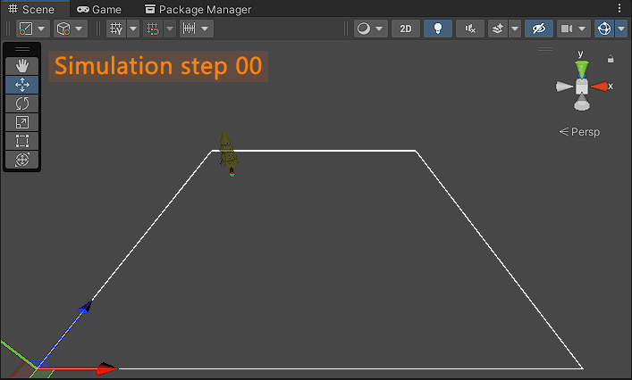 | 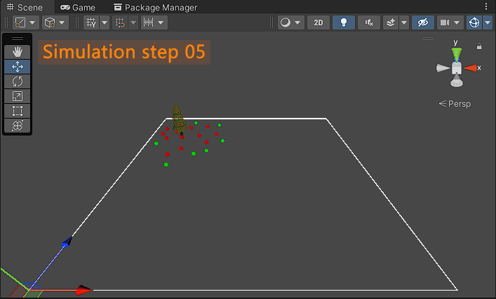 |
| --- | --- |
| 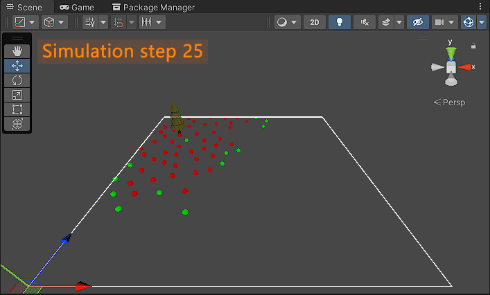 | 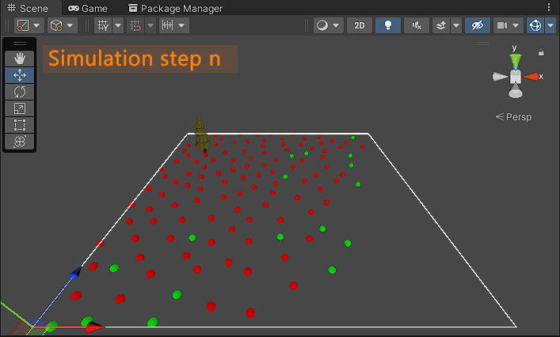 |

| Progression of simulation from 0 to n number of steps, where n is any finite number... red markers represent closed seeds while green are open seeds. |
| -- |

Before we start writing the algorithm, lets first define some data structures.
1. **FoliagePrototype** represents the actual foliage object (tree or grass etc.) that would be spawned and contains settings local to that prototype for example scale factor, collision settings, reference to the "FoliageSpecie it belongs to etc.
2. Next up is the **Specie** class, this would represent global behaviors and also group together different foliage prototypes for a particular specie. This class is also responsible for the actual simulation step. We will represent a specie with a "scriptable" object, since we want to be able to save and reuse it.

OK, lets start with the first data structure "the FoliagePrototype class", add the following fields (see along code for details).

```
using UnityEngine;


public class FoliagePrototype : MonoBehaviour
{
    // public
    public int scatterRadius = 15;        // radius (in meters) in which new seeds will be scattered around this prototype
    public float scaleMultiplier = 1f;    // value to control size of this game object when spawned
    public float scaleVariation = 0.25f;  // scale randomness factor
    public bool debug = false;

    // private
    [SerializeField] private float colliderRadius = 1f;  // sphere collider radius of this prototype
    [SerializeField] private Vector3 colliderPosOffset = Vector3.zero;  // collider position offset from pivot position

    // properties
    public float ColliderRadius { get { return colliderRadius; } }
    public Vector3 ColliderPosOffset { get { return colliderPosOffset; } }
}
```

Before we move on to next class, add some visual debugging, I am using gizmos to draw a visual representation of scatter radius and collider.

```
public void OnDrawGizmos()
{
    if (!debug)
        return;

    // draw to sphere to visualize the collider radius
    Gizmos.color = new Color(1f, 0.3f, 0.1f, 0.5f);
    Gizmos.DrawSphere(transform.position + colliderPosOffset * transform.localScale.magnitude, colliderRadius * transform.localScale.magnitude);

    // draw a circle a visualize seed scatter radius 
    Vector3 lastPos = transform.position + (Vector3.right * scatterRadius);
    for (int i = 0; i <= 15; i++)
    {
        float circumferenceProgress = (float)i / 15;
        float currentRadians = circumferenceProgress * 2 * Mathf.PI;
        Vector3 pos = new Vector3(Mathf.Cos(currentRadians) * scatterRadius, 0, Mathf.Sin(currentRadians) * scatterRadius);
        pos += transform.position;

        Gizmos.DrawLine(lastPos, pos);
        lastPos = pos;
    }
}
```

Attach this script to a tree or plant like game object, toggle on "debug" from inspector and tweak scatter radius and collider settings appropriately.

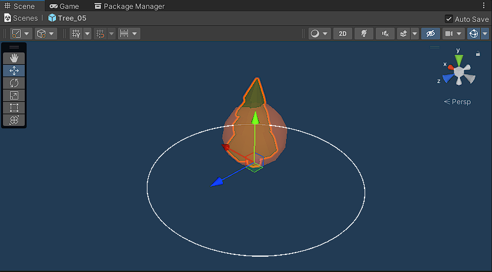

Next up is the specie class, this will be a scriptable object type, I have also declared the necessary variables, see comments along code for details.

```
using System.Collections.Generic;
using System.Linq;
using System.Threading.Tasks;
using UnityEngine;


[System.Serializable]
[CreateAssetMenu(fileName = "FoliageSpecie", menuName = "FoliageSimulation/FoliageSpecie")]
public class Specie : ScriptableObject
{
    // -----------------public----------------- //
    [Header("SpawnSettings")]
    public int spawnsPerIteration;  // number of seeds spawned per each iteration.
                                    // higer value will represent agressive species that will quickly cover more land area.

    public int initialSeedsCount = 1;   // initial number of seeds that will be placed before the simulation begins.

    public FoliagePrototype prototype;  // prototype for this specie, this can also be a list of prototypes, at each iteration a
                                        // prototype is selected to spawn.

    [Header("Other")]
    public string specieName;  // name of this specie

    // -----------------private----------------- //
    private List<FoliagePrototype> seeds = new List<FoliagePrototype>();  // parent seeds from where the first open seeds are collected,
                                                                          // these can be randomly or manually scattered in the scene.

private List<Vector3> spawnedPositions = new List<Vector3>();  // list of positions where items from this specie have been spawned, initially
                                                               // this list is filled from seeds list, at each iteration open seeds positions
                                                               // from this list are iterated over and seeds at these positions scatter more
                                                               // seeds in surrounding area and the cycle continues until there are no more
                                                               // open seed left.

    private int openSeedsStartIndex;  // indexes into spawnedPositions list, positions before this index are considered closed
    private int currentSpawnCount;    // keep tracks of number of items spawned so for, just for debugging purpose.

    // -----------------properties----------------- //
    public List<FoliagePrototype> Seeds { get { return seeds; } }

    public List<Vector3> SpawnPositions { get { return spawnedPositions; } }
}
```

add the necessary methods for "Specie" class, actual simulation take place in Simulation asyn method, we will implement it later.

```
[System.Serializable]
[CreateAssetMenu(fileName = "FoliageSpecie", menuName = "FoliageSimulation/FoliageSpecie")]
public class Specie : ScriptableObject
{
    /// <summary>
    /// This method fills spawnedPositions list from seeds list,
    /// it should be called once before 1st simulation step.
    /// </summary>
    public void Init()
    {
        var xx = from i in Enumerable.Range(0, seeds.Count) where seeds[i] != null select seeds[i].transform.position;
        spawnedPositions.AddRange(xx);
    }

    public void Reset()
    {
        spawnedPositions.Clear();
        openSeedsStartIndex = 0;
        currentSpawnCount = 0;
    }

    public async Task Simulate()
    {
    }
}
```

that's all for "Specie" class and as mentioned before we will give a reference to the "Specie" to "FoliagePrototype" class.

```
public class FoliagePrototype : MonoBehaviour
{
    // ^^ previous code ^^
    // private
    [SerializeField] private Specie specie = null;

    // properties
    public Specie Specie { get { return specie; } }


    public void SetSpecie(Specie specie)
    {
        this.specie = specie;
    }
}
```

Now we will add a manager class for entire simulation system, lets call it "FoliageSimulation", this manager class will be responsible for things like,

* Scattering the initial seeds.
* Storing the actual spawned prototypes data.
* Defining global variables like images masks for rocks and other invalid areas.
* Validating a spawn position etc.

First lets define a spawn area, I am going to use a parallelogram but feel free to use any other shape, create an empty game object and add the "FoliageSimulation.cs" to it.

```
public class FoliageSimulation : MonoBehaviour
{
    // public
    [Header("SimulationSettings")]
    public float boundsScale = 50;

    [Header("DebugSettings")]
    public bool debug = false;
    public bool drawAreaBounds = false;
    public int spawnCount = 0;

    [Header("FoliageSpeciesData")]
    public List<Specie> foliageSpecies = new List<Specie>(); // list of foliage specie scriptable objects, initial seeds will be
                                                             // scattered from species defined in this list.

    // private
    [SerializeField] private int currentSimSteps = 0;  // current simulation steps count
    private bool simRunning = false;  // is simulation running?
    [System.NonSerialized]
    private readonly Vector3[] bounds = {
                new Vector3(0, 0, 0),  // origin
                new Vector3(1, 0, 0),  // bottom right
                new Vector3(1, 0, 1),  // top right
                new Vector3(0, 0, 1),  // top left 
            };


    private void OnDrawGizmos()
    {
        if (!debug)
            return;

        if (drawAreaBounds)
        {
            // draw bounds
            Gizmos.color = Color.white;
            Gizmos.DrawLine(bounds[0] * boundsScale, bounds[1] * boundsScale);
            Gizmos.DrawLine(bounds[1] * boundsScale, bounds[2] * boundsScale);
            Gizmos.DrawLine(bounds[2] * boundsScale, bounds[3] * boundsScale);
            Gizmos.DrawLine(bounds[3] * boundsScale, bounds[0] * boundsScale);
        }
    }
}
```

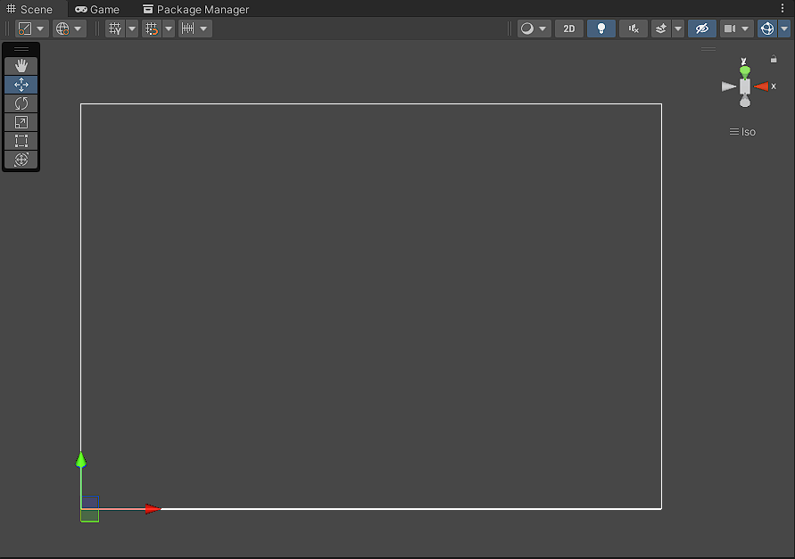

After determining the spawn area, we will spawn some seeds from where first "open seeds" will be collected and simulation will begin, add the following new fields to "FoliageSimulation" class ignore existing ones, you will understand their purpose as we progress.

```
public class FoliageSimulation : MonoBehaviour
{
    // public
    [Header("SimulationSettings")]
    public float boundsScale = 50;
    public int simulationSteps = 25;

    [Header("SpawnSettings")]
    public Transform seedsParent = null;
    public Transform prototypesParent = null;

    [Header("DebugSettings")]
    public bool debug = false;
    public bool drawAreaBounds = false;
    public int spawnCount = 0;

    [Header("FoliageSpeciesData")]
    public List<Specie> foliageSpecies = new List<Specie>(); // list of foliage specie scriptable objects, initial seeds will be
                                                             // scattered from species defined in this list.

    // private
    private List<FoliagePrototype> spawnedPrototypes = new List<FoliagePrototype>();  // spawned prototypes list
    [SerializeField] private int currentSimSteps = 0;  // current simulation steps count
    private bool simRunning = false;  // is simulation running?
    [System.NonSerialized]
    private readonly Vector3[] bounds = {
                new Vector3(0, 0, 0),  // origin
                new Vector3(1, 0, 0),  // bottom right
                new Vector3(1, 0, 1),  // top right
                new Vector3(0, 0, 1),  // top left 
            };

    // properties
    public static FoliageSimulation Instance { get { return GameObject.Find("FoliageSim").GetComponent<FoliageSimulation>(); } }
    public List<FoliagePrototype> SpawnedPrototypes { get { return spawnedPrototypes; } }
    public bool SimRunning { get { return simRunning; } }
    public Vector3[] Bounds { get { return bounds; } }
}
```

Lets also define some handy methods,

* **ScatterSeeds** this method randomly spawns seeds for each foliage specie, it does so by looping over all specie definitions and clearing their existing spawned data, then again in a nested loop, iterate n times (where n is initial seed spawn count of a particular specie) and for each iteration of the nested loop it gets a random uniform point in parallelogram and also validates the spawn position for the new seed that is to be spawned, otherwise seed spawn is ignored.
* **ClearSeeds** and **ClearPrototypes** clear existing spawned seeds and prototypes data respectively.
* The other two methods are just placeholders for now.

```
public class FoliageSimulation : MonoBehaviour
{
    public void ScatterSeeds()
    {
        if (simRunning)
            return;

        if (!seedsParent)
            return;

        ClearSeeds();  // first clear existing 

        // spawn new seeds
        for (int i = 0; i < foliageSpecies.Count; i++)
        {
            foliageSpecies[i].Seeds.Clear();  // first clear existing seed positions

            if (foliageSpecies[i].prototype == null)
                continue;

            for (int j = 0; j < foliageSpecies[i].initialSeedsCount; j++)
            {
                Vector3 randSeedPos = GetUniformInParallelogram(bounds, boundsScale);
                randSeedPos.y = 2625f;

                if (ValidateSpawnPos(randSeedPos, foliageSpecies[i].prototype, seedsParent.GetComponentsInChildren<FoliagePrototype>().ToList()))
                {
                    FoliagePrototype seedPrototype = foliageSpecies[i].prototype;
                    FoliagePrototype spawnedSeed = Instantiate(seedPrototype, randSeedPos, Quaternion.identity, seedsParent);
                    spawnedSeed.SetSpecie(foliageSpecies[i]);
                    foliageSpecies[i].Seeds.Add(spawnedSeed);
                }
            }
        }
    }

    public void ClearSeeds()
    {
        while (seedsParent.childCount > 0)
            DestroyImmediate(seedsParent.GetChild(0).gameObject);
    }

    public void ClearPrototypes()
    {
        while (prototypesParent.childCount > 0)
            DestroyImmediate(prototypesParent.GetChild(0).gameObject);

        for (int i = 0; i < foliageSpecies.Count; i++)
            foliageSpecies[i].Reset();

        spawnedPrototypes.Clear();
        spawnCount = 0;
    }

    public void StartSimulation()
    {
    }

    public void StopSimulation()
    {
    }
}
```

"ValidateSpawnPos" and "GetUniformInParallelogram" are static methods and defined elsewhere in your code,
* **ValidateSpawnPos** validates a spawn position, it does so by iterating over all existing spawn prototypes and using sphere to sphere collision detection detects if there is a collision with the incoming prototype.
* **GetUniformInParallelogram** returns a random point inside the bounds area we defined earlier.

```
    #region static_methods
    public static bool ValidateSpawnPos(Vector3 point, FoliagePrototype prototype, List<FoliagePrototype> fromPrototypes)
    {
        // this brute force for loop check should be replaced by some nearest neighbour search algorithm
        // (KD-Tree or perhaps a quad tree implementation)
        for (int i = 0; i < fromPrototypes.Count; i++)
        {
            float r1, r2;
            Vector3 p1, p2;

            p1 = fromPrototypes[i].transform.position;
            r1 = fromPrototypes[i].ColliderRadius * fromPrototypes[i].transform.localScale.magnitude;

            p2 = point;
            r2 = prototype.ColliderRadius * prototype.transform.localScale.magnitude;

            // -------------------------------- //
            // sphere to sphere collision check
            // 
            // radius squared
            float rSquared = r1 + r2;
            rSquared *= rSquared;
            //
            // distance squared
            float dSquared = Vector3.Dot(p2 - p1, p2 - p1);
            // 
            // 
            if (dSquared < rSquared)
                return false;
        }

        return true;
    }

    /// <summary>
    /// polygon[0] = ORIGIN; polygon[1] = BOTTOM_RIGHT; polygon[2] = TOP_RIGHT; polygon[3] = TOP_LEFT
    /// </summary>
    /// <param name="polygon"></param>
    /// <param name="scale"></param>
    /// <returns></returns>
    public static Vector3 GetUniformInParallelogram(Vector3[] polygon, float scale)
    {
        var a = polygon[1] - polygon[0];
        var b = polygon[3] - polygon[0];

        var u1 = UnityEngine.Random.Range(0f, 1f);
        var u2 = UnityEngine.Random.Range(0f, 1f);

        return u1 * (a * scale) + u2 * (b * scale);
    }
    #endregion
```

To actually call the methods in "FoliageSimulation" class, its best to create a custom inspector.

```
#if UNITY_EDITOR
[CustomEditor(typeof(FoliageSimulation))]
public class FoliageSimulationEd : Editor
{
    FoliageSimulation sim;

    private void OnEnable()
    {
        sim = target as FoliageSimulation;
    }

    public override void OnInspectorGUI()
    {
        base.OnInspectorGUI();

        GUILayout.Space(5f);

        using (new GUILayout.HorizontalScope())
        {
            if (GUILayout.Button("Scatter Seeds"))
                sim.ProcedurallyScatterSeeds();
            else if (GUILayout.Button("Clear Seeds"))
                sim.ClearSeeds();
        }

        if (!sim.SimRunning && GUILayout.Button("Start Simulation"))
            sim.StartSimulation();

        else if (sim.SimRunning && GUILayout.Button("Stop Simulation"))
            sim.StopSimulation();

        if (GUILayout.Button("Clear Spawned"))
        {
            sim.StopSimulation();
            sim.ClearPrototypes();
        }

        Color old = GUI.backgroundColor;
        GUI.backgroundColor = Color.red;

        if (GUILayout.Button("Clear All"))
        {
            sim.StopSimulation();
            sim.ClearSeeds();
            sim.ClearPrototypes();
        }

        GUI.backgroundColor = old;
    }
}
#endif 
```

And this is how our custom inspector looks like, create a empty game objects, one for seeds parent and one for prototypes parent, reset their transforms and add their references to seeds and prototypes parent fields respectively.

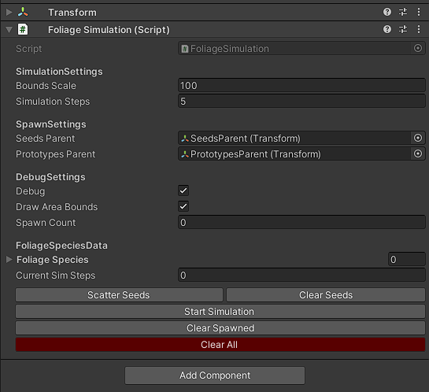

Create one or more specie scriptable objects, add them to the foliage specie" list, give each specie scriptable object a reference to the foliage prototype and adjust the specie settings appropriately, species with higher spawns per iteration are aggressive and grow into surrounding areas much quicker.  

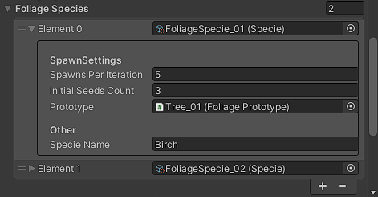

Finally, hit the scatter seeds button and you will get some random scattered seeds.

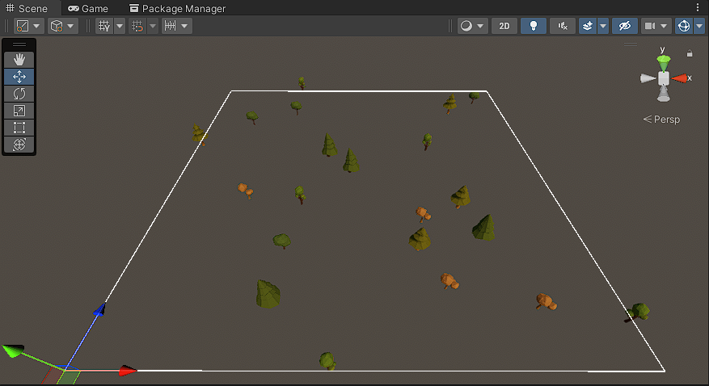

All that is left now is to code the actual simulation, we will begin by implementing the "Start" and "Stop" simulation methods of "FoliageSimulation" class,
* **StopSimulation** method is simple we set current simulation steps to number of simulation set by user so simulation can stop.
* In **StartSimulation** we first clear existing prototypes and sets condition necessary to initiate the simulation, which is initiated by "BeginSimulation" method.

```
public class FoliageSimulation : MonoBehaviour
{
    public void StartSimulation()
    {
        // make sure we have a parent for spawned gameobjects
        if (!prototypesParent)
        {
            Debug.Log("No prototypes parent....!");
            StopSimulation();  // stop the sim and return
            return;
        }

        currentSimSteps = 0;
        ClearPrototypes();

        for (int i = 0; i < foliageSpecies.Count; i++)
            foliageSpecies[i].Reset();

        simRunning = true;

        foreach (var specie in foliageSpecies)
            specie.Init();

        BeginSimulation();
    }

    public void StopSimulation()
    {
        simRunning = false;
        currentSimSteps = simulationSteps;
    }
}
```

and here is the implementation for "BeginSimulation" method, where we continue to simulate until "currentSimulationSteps" are less than "simulationSteps" or the user hits "Stop Simulation".

```
public class FoliageSimulation : MonoBehaviour
{
    async void BeginSimulation()
    {
        while (simRunning && currentSimSteps < simulationSteps)
        {
            for (int i = 0; i < foliageSpecies.Count; i++)
                await foliageSpecies[i].Simulate();
            currentSimSteps++;
        }
        StopSimulation();
        Debug.Log("Simulation complete.");
    }
}
```

and now to code the heart of this algorithm, which is the simulate method of "Specie" class, first add two new static methods elsewhere in your code probably together with static methods we created earlier.

* **PointInSquare** determines if a point is inside a square area and returns true or false based on that, we will use it to check if any given spawn position is within our defined are for simulation.
* **GetUniformPosInCircle** returns a uniform distributed point inside a circle of given radius r. 

```
    public static bool PointInSquare(Vector3 btmLeftPoint, Vector3 topRightPoint, Vector3 testPoint)
    {
        if ((testPoint.x > btmLeftPoint.x && testPoint.x < topRightPoint.x) && (testPoint.z > btmLeftPoint.z && testPoint.z < topRightPoint.z))
            return true;
        return false;
    }

    public static Vector3 GetUniformPosInCircle(int radius)
    {
        float theta = 2 * Mathf.PI * UnityEngine.Random.Range(0f, 1f);
        var r = radius * Mathf.Pow(UnityEngine.Random.Range(0f, 1f), 1 / 2f);
        return new Vector3(r * Mathf.Cos(theta), 0, r * Mathf.Sin(theta));
    }
```

I am going to walk you through a cut short version of this algorithm, we first keep track of current spawn count and open seeds count which is determined by subtracting open seeds start index from spawned positions count, this works because spawned positions have been incremented by the end of this method while open seeds start index remain the same. 

```
    public async Task Simulate()
    {
        openSeedsStartIndex = spawnedPositions.Count - openSeedsStartIndex;
        currentSpawnCount = spawnedPositions.Count;
    }
```

Move ahead and update the simulation code, here we are 
1. Iterating over all open seeds.
2. In a nested loop we are again iterating "spawnsPerIteration" number of times.
3. Getting a random seed position in a circle of radius r (where r = foliage prototype scatter radius) finally adding the corresponding spawned position to it to make its position relative to the seed's position.

```
    public async Task Simulate()
    {
        openSeedsStartIndex = spawnedPositions.Count - openSeedsStartIndex;
        currentSpawnCount = spawnedPositions.Count;

        for (int i = openSeedsStartIndex; i < currentSpawnCount; i++)
        {
            for (int j = 0; j < spawnsPerIteration; j++)
            {
                Vector3 newSeedPos = FoliageSimulation.GetUniformPosInCircle(prototype.scatterRadius);
                newSeedPos += spawnedPositions[i];
            }
        }
    }
```

In nest step we check if the new point is within the square bounds.

```
    public async Task Simulate()
    {
        openSeedsStartIndex = spawnedPositions.Count - openSeedsStartIndex;
        currentSpawnCount = spawnedPositions.Count;

        for (int i = openSeedsStartIndex; i < currentSpawnCount; i++)
        {
            for (int j = 0; j < spawnsPerIteration; j++)
            {
                Vector3 newSeedPos = FoliageSimulation.GetUniformPosInCircle(prototype.scatterRadius);
                newSeedPos += spawnedPositions[i];

                // check if the position is withing the square bounds we defined earlier
                if (FoliageSimulation.PointInSquare(FoliageSimulation.Instance.Bounds[0] * FoliageSimulation.Instance.boundsScale,
                    FoliageSimulation.Instance.Bounds[2] * FoliageSimulation.Instance.boundsScale,
                    newSeedPos))
                {

                }
            }
        }
    }
```

Next up is randomizing the scale of prototype of we are going to spawn and collision detection, setting the new scale first is important to get the correct radius of the manually defined colliders which is used for collision detection by the "ValidateSpawnPos" method.

```
// create a randomized scale
float scaleVariation = UnityEngine.Random.Range(0.01f, prototype.scaleVariation);
Vector3 randScale = new()
{
    x = (prototype.transform.localScale.x * prototype.scaleMultiplier) * (1f - scaleVariation),
    y = (prototype.transform.localScale.y * prototype.scaleMultiplier) * (1f - scaleVariation),
    z = (prototype.transform.localScale.z * prototype.scaleMultiplier) * (1f - scaleVariation),
};

// check for spawn conditions
if (prototype && FoliageSimulation.ValidateSpawnPos(newSeedPos, prototype, FoliageSimulation.Instance.SpawnedPrototypes))
{

}
```

finally, if we have a valid spawn position, then we will Instantiate the prototype and update the system.

```
// check for spawn conditions
if (prototype && FoliageSimulation.ValidateSpawnPos(newSeedPos, prototype, FoliageSimulation.Instance.SpawnedPrototypes))
{
    FoliagePrototype newPrototype = GameObject.Instantiate(prototype, FoliageSimulation.Instance.prototypesParent);
    newPrototype.transform.position = newSeedPos;
    newPrototype.transform.localScale = randScale;
    newPrototype.transform.rotation = Quaternion.AngleAxis(Random.Range(0, 360), Vector3.up);
    newPrototype.SetSpecie(this);

    // add to total spawned prototypes
    FoliageSimulation.Instance.SpawnedPrototypes.Add(newPrototype);

    spawnedPositions.Add(newSeedPos);
    openSeedsStartIndex++;
    FoliageSimulation.Instance.spawnCount = FoliageSimulation.Instance.SpawnedPrototypes.Count;

    await Task.Delay(System.TimeSpan.FromSeconds(0.001f));
}
```

That's all for the coding part, hit the "Simulate" button and if all is well then you will have a nice foliage simulation running.

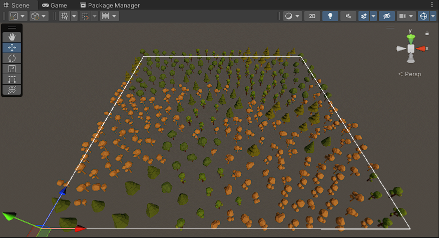