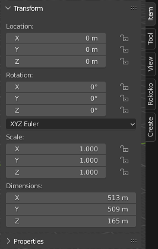
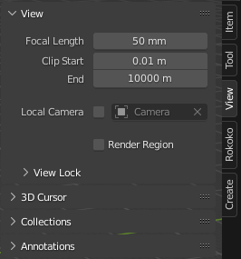
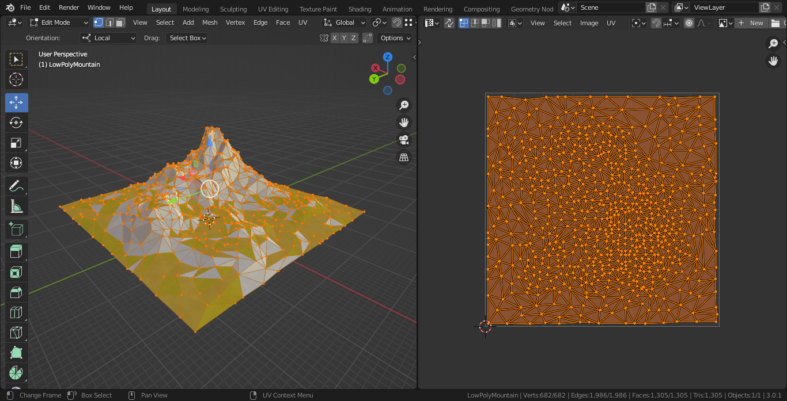
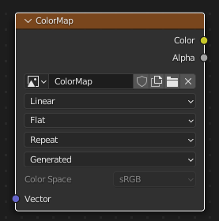
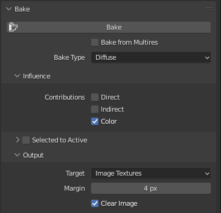
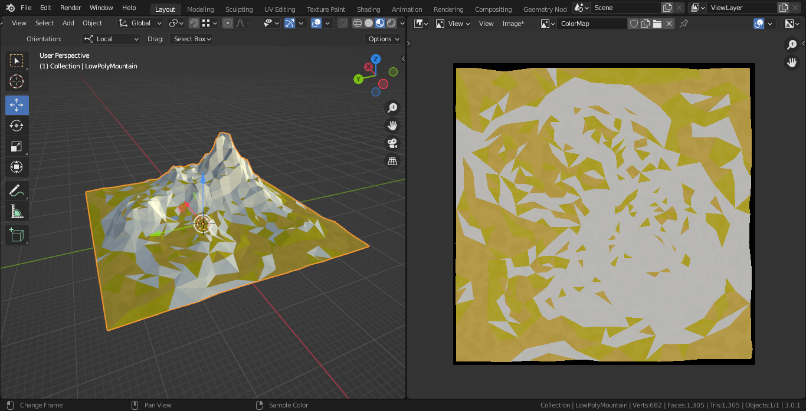
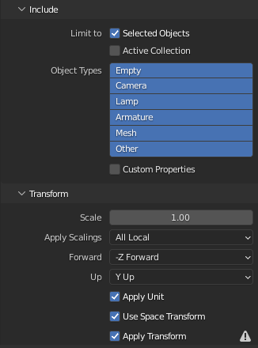

## Low poly background mountain workflow in Blender and Unity

> Download project files for this tutorial from CodeCreatePlay [Patreon](https://www.patreon.com/CodeCreatePlay "Patreon") page.

****

In last part me modeled and textured the low poly mountain, in this part we will export out the texture maps and low poly mountain mesh from Blender to Unity.  
Exporting the mesh is as easy as exporting an .FBX file from Blender, however textures maps (in this case color maps only) are needed to be baked, before they can be exported.  

## Baking texture maps
This step involves baking texture maps from scene geometry, make sure all your transformations are applied on mesh **Select the Mesh > Ctrl+A > Apply > Location, Rotation and Scale** and that the mesh is exactly at origin, however before this step you would probably want to scale your low poly mountain since by default A.N.T landscapes are 2m * 2m in length, which is quite small for a background mountain, for example I have scaled mine to 512m * 512m.  
If you scale your terrain then make sure to set the viewport camera's clip end to a large value so that terrain is in view entirely without clipping.

|  |  |
| -- | -- |
| 01 | 02 |

A.N.T landscapes by default do not have UV-mapping applied, so to apply UV-mapping, move to top view, enter the edit mode and hit **U** key, finally from quick selection menu select **Project From View**.

Create a new image in image editor, set its size to whatever the texture size you want for your color map (make sure its squared).  
In the shader editor create a new texture node, and set the image to the color map texture we just created.

The only thing left now is to actually bake the color map, to do that, change rendering engine to "Cycles" if not already, make sure that the "ColorMap" texture node and the low poly mountain is selected, finally, from **Render Properties > Bake** panel, adjust settings so that only color information gets baked or rendered.  

Once everything is done, hit the Bake button, you should have color map baked without any errors.

Finally from the image editor, save the image as a .tiff with alpha channel, color depth of 16 and no compression.

## Exporting the low poly model as a .FBX
Exporting the low poly model is easy, I have found .FBX format works best for me but you can experiment around, I have attached a screenshot of my .FBX export settings.

## Importing in Unity
Import both the "ColorMap.tiff" and "LowPolyMountain .fbx" files into Unity.  
Create a new material, assign "ColorMap.tiff" to the albedo texture slot, set both metallic and smoothness values to zero, assign this new material to the low poly mountain.  

