## Low poly background mountain workflow in Blender and Unity

> Download project files for this tutorial from CodeCreatePlay [Patreon](https://www.patreon.com/CodeCreatePlay "Patreon") page.

****

## Modeling and Texturing

In this tutorial, I will give you a process overview for creating a simple low poly mountain environment.  
I will be using Blender A.N.T landscape plugin to create the base shape, further refinements are done using manual sculpting, finally we will create materials using Blender Cycles and export to Unity.  

To start off the tutorial, create a new Blender scene, delete the default scene lights and cube and add a new A.N.T landscape **Shift+A > Mesh > Landscape**. There are dozens of settings and parameters you can adjust to get a right shape for your terrain but this is not a A.N.T landscape tutorial (that's for another tutorial) so you just copy the settings and values I am using.

* Subdivisions: 64*64
* Noise Type: vlNoise hTerrain
* Noise Basics: New Perlin
* Random Seed: 194
* Noise size: 0.90
* vlNoise Basics: Blender
* Height: 1.12
* Maximum: 1.50
* Falloff X and Y: 4

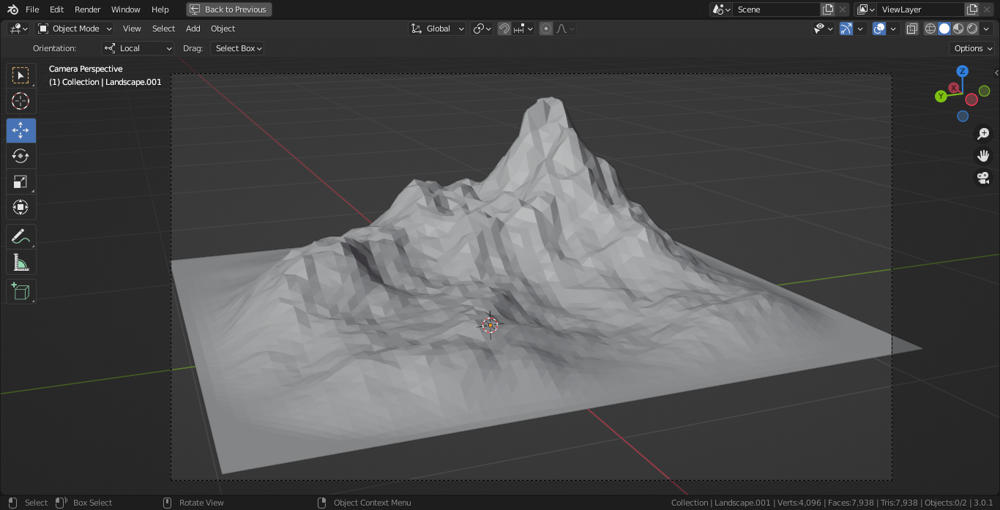

As you can see the edges of this terrain are really flat, so to fix that go to sculpt mode, turn on **Dyntopo** and set **Detail Size** to a high value for example 20.0, and start sculpting in some fine details to flat areas, closer to the edges.

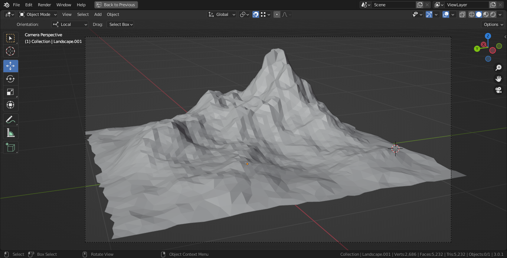

(This is an optional step, the change the final look of terrain based on my personal preferences) After you are done sculpting, get back to object mode and add a decimate modifier and change decimate type to "Collapse" and set ratio value to anything between 0.25 - 0.5, this will remove all those blocky faces and create a more authentic low poly art style.

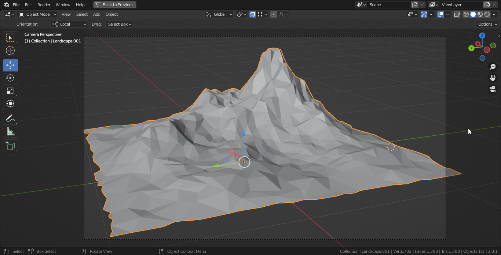

****
## Material Creation In Blender

The modeling part is done, the next step is to create a procedural material and texture...the first step will be to separate out the cliff part of geometry and for that we need to find the inclination value W.R.T world up axis, in case of blender the z-axis. Ideally we would like to find the direction of normal vector at every point (or face) in mesh. From linear algebra we know that,

$$\hat{n}.\hat{z}=\cos\theta$$

where $\hat{n}$ is the face normal, $\hat{v}$ is world up axis and $\theta$ is the desired angle, solving for angle we get,

$$\theta=\arccos(\hat{n}.\hat{z})$$
$$where \ \hat{n}=face \ normal$$

We will start by solving the dot product first, add a **Input > Geometry** node and a **Converter > Vector Math** node, set operation type of math mode to "Dot Product", connect the "Normal" output of geometry node to first input of vector math node and set its second input to world up axis I.E (0, 0, 1), we now have the dot product.

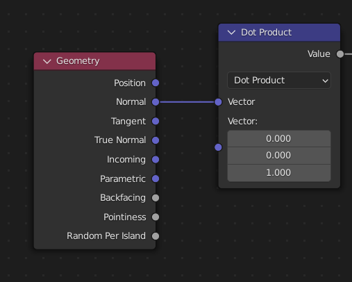

To find the $\arccos$, add a **Converter > Math** node and set operation type to "Arccosine", connect output of dot product node to input of arccosine node, the output value of arccosie node is the angle $\theta$ between world up axis and the face normal at any point on mesh.

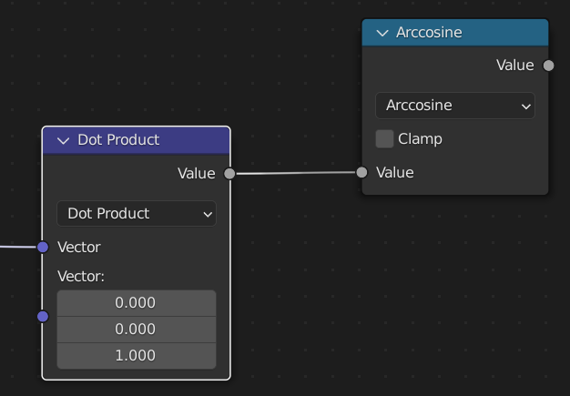

Now the angle $\theta$ value can be directly specified (in radians) and masked using a **Converter > Math (Greater than)** node.

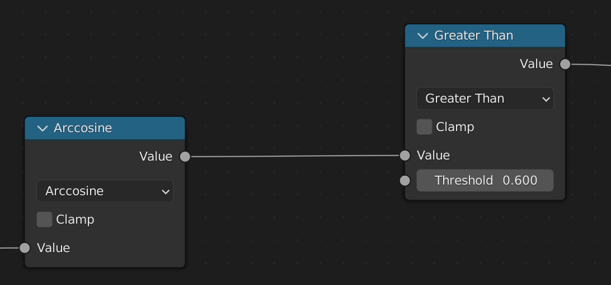

However, specifying value for $\theta$ is a slight inconvenience and not very intuitive to work with, so to be able to specify a in degrees we need to multiply the value in degrees with $\pi /180$ (the radians to degree conversion factor).

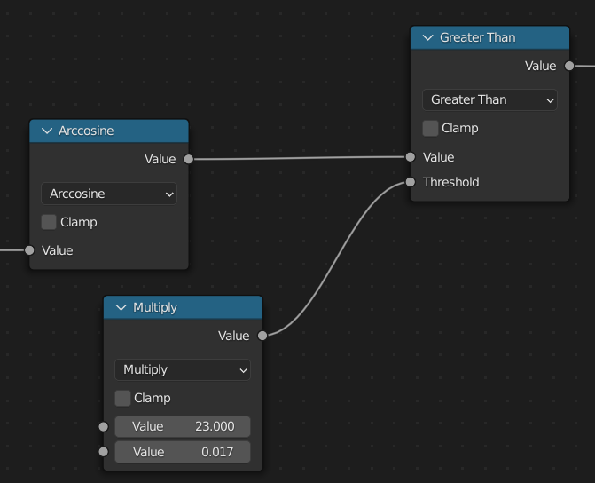

Since we have a mask now, you can add two diffuse material nodes and a mix shader node to combine the two diffuse and use the "Greater Than" math node to act as a mask.

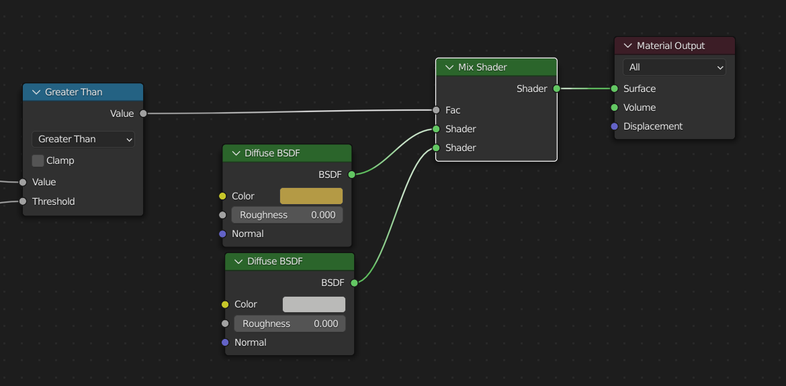

In **Render Settings > Color Management** change **Look = Very High Contrast**, this will give a better preview of the low poly art style in view port.  

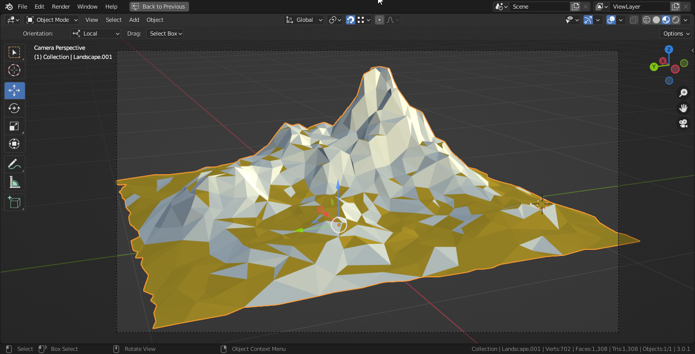

To add bit more variations in ground texture, I masked out the flat most areas of terrain and kept the base dirt texture there while applied a grassy texture to remaining somewhat steep areas minus the cliff mask. The selected nodes in image below shows this setup.

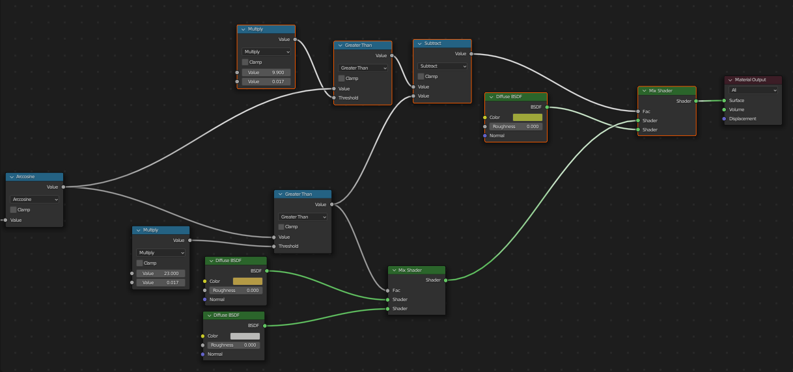

As a final step in material creation I added a subtle noise texture and blended it with existing colors, this will give bit more variations in the final texture.

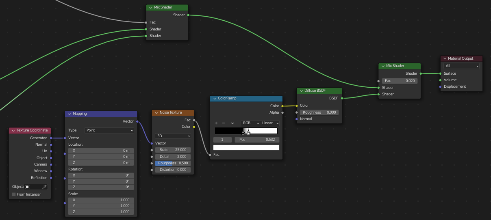
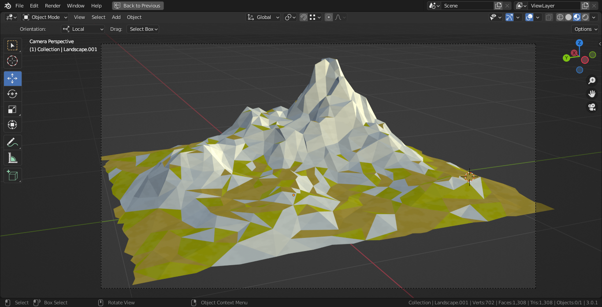

That's all for this tutorial, In the next tutorial we will bake out the texture maps and export them to Unity.